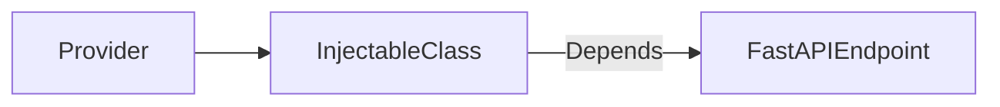

# Dependency Injection Architecture

Local Newsifier uses **fastapi-injectable** exclusively. The previous custom container and its adapter have been removed.

## Overview

1. Provider functions in `local_newsifier.di.providers` create and configure dependencies.
2. Classes and functions declare dependencies with `Annotated[Type, Depends(provider)]` and are decorated with `@injectable` when necessary.
3. FastAPI resolves the providers and injects the resulting objects.

## Provider Workflow



### Example Service

```python
from typing import Annotated
from fastapi import Depends
from fastapi_injectable import injectable

@injectable(use_cache=False)
class ArticleService:
    def __init__(self, session: Annotated[Session, Depends(get_session)]):
        self.session = session
```

### Endpoint Usage

```python
@app.get("/articles/{article_id}")
async def get_article(
    article_id: int,
    service: Annotated[ArticleService, Depends()]
):
    return service.fetch(article_id)
```

## Best Practices

- Place all provider functions in `di/providers.py`.
- Use `use_cache=False` unless the dependency is completely stateless.
- Avoid circular imports by keeping provider implementations lightweight.

## Testing

Tests should patch provider functions using fixtures. See `docs/testing_injectable_dependencies.md` for patterns.
