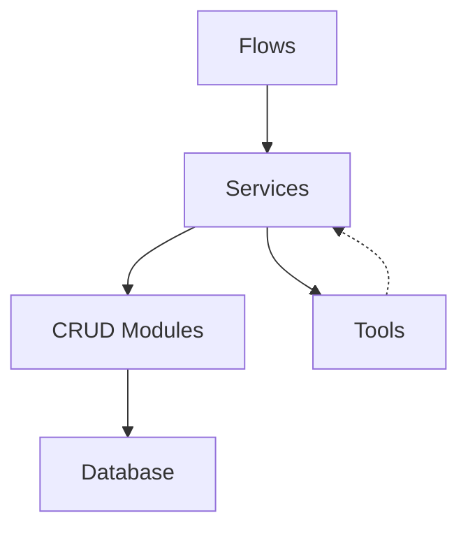

# System Patterns

## Architectural Patterns

### Hybrid Architecture

We use a hybrid architecture that combines elements of several architectural patterns:

1. **Repository Pattern** (via CRUD modules)
   - Encapsulates database operations
   - Provides a consistent interface for data access
   - Hides implementation details of data storage

2. **Service Layer Pattern**
   - Coordinates between CRUD operations and tools
   - Implements business logic and transaction management
   - Provides a clean API for higher-level components

3. **Pipeline Processing**
   - Used for article processing workflows
   - Sequential processing of data through multiple stages
   - Allows for flexibility in adding or modifying processing steps

### Component Relationships



- **Flows** orchestrate end-to-end processes using services
- **Services** coordinate between CRUD modules and tools
- **CRUD Modules** handle database operations
- **Tools** perform specific processing or analysis tasks
- Tools return results to services, which may save them via CRUD modules

## Design Patterns

### Repository Pattern (CRUD)

All database operations are encapsulated in CRUD classes that follow a consistent pattern:

```python
class CRUDBase[T]:
    def get(self, db, id): ...
    def get_multi(self, db, skip, limit): ...
    def create(self, db, obj_in): ...
    def update(self, db, db_obj, obj_in): ...
    def delete(self, db, id): ...
```

Specialized CRUD classes extend this base class to add entity-specific operations:

```python
class CRUDEntity(CRUDBase[Entity]):
    def get_by_article(self, db, article_id): ...
    def get_by_text_and_article(self, db, text, article_id): ...
    def get_by_date_range_and_types(self, db, start_date, end_date, entity_types): ...
```

### Service Layer

Services coordinate higher-level operations between CRUD modules and tools:

```python
class AnalysisService:
    def __init__(self, analysis_result_crud=None, article_crud=None, entity_crud=None, session_factory=None):
        self.analysis_result_crud = analysis_result_crud or analysis_result
        self.article_crud = article_crud or article
        self.entity_crud = entity_crud or entity
        self.session_factory = session_factory or SessionManager
        
    def analyze_headline_trends(self, start_date, end_date, time_interval="day"):
        with self.session_factory() as session:
            # Use CRUD to get data
            # Use tools to analyze
            # Save results using CRUD
```

### Dependency Injection

Components accept their dependencies as constructor parameters with sensible defaults:

```python
def __init__(
    self,
    analysis_result_crud=None,
    article_crud=None,
    entity_crud=None,
    session_factory=None
):
    self.analysis_result_crud = analysis_result_crud or analysis_result
    self.article_crud = article_crud or article
    self.entity_crud = entity_crud or entity
    self.session_factory = session_factory or SessionManager
```

This pattern facilitates:
- Unit testing with mocks
- Flexibility in component configuration
- Clear dependency relationships

### Pipeline Processing

Article processing follows a pipeline pattern:

```python
class NewsPipeline:
    def process_article(self, article):
        article = self.fetch_content(article)
        article = self.extract_entities(article)
        article = self.analyze_sentiment(article)
        article = self.detect_topics(article)
        return article
```

### Context Managers for Sessions

Database sessions are managed using context managers:

```python
class SessionManager:
    def __enter__(self):
        engine = get_engine()
        self.session = Session(engine)
        return self.session

    def __exit__(self, exc_type, exc_val, exc_tb):
        if self.session:
            if exc_type:
                self.session.rollback()
            else:
                self.session.commit()
            self.session.close()
```

Services use this pattern for transaction management:

```python
with self.session_factory() as session:
    # Database operations
    # If an exception occurs, session will be rolled back
    # Otherwise, session will be committed
```

## Core Implementation Patterns

### Model Definitions

SQLModel is used for model definitions, providing both ORM and Pydantic validation:

```python
class Entity(SQLModel, table=True):
    id: Optional[int] = Field(default=None, primary_key=True)
    article_id: int = Field(foreign_key="article.id")
    text: str
    entity_type: str
    sentence_context: Optional[str] = None
    frequency: Optional[int] = None
    confidence: Optional[float] = Field(default=1.0)
    created_at: datetime = Field(default_factory=lambda: datetime.now(timezone.utc))
    updated_at: datetime = Field(default_factory=lambda: datetime.now(timezone.utc))
```

### Tool Implementation

Tools focus on specific processing or analysis tasks without direct database access:

```python
class TrendAnalyzer:
    def __init__(self, session=None):
        self.session = session
        self._cache = {}
        self.nlp = None
        
    def extract_keywords(self, headlines, top_n=20):
        # Process headlines to extract keywords
        # Return processed data
        
    def detect_keyword_trends(self, trend_data):
        # Analyze trend data to identify patterns
        # Return trend analysis results
```

### Error Handling

Structured error handling with appropriate error propagation:

```python
try:
    # Operation that might fail
except SomeSpecificException as e:
    # Handle specific exception
    return {"error": str(e)}
except Exception as e:
    # Log unexpected errors
    logger.exception(f"Unexpected error: {e}")
    raise
```

## Testing Patterns

### Unit Testing with Mocks

Services and tools are tested using mock objects for dependencies:

```python
@patch("local_newsifier.tools.analysis.trend_analyzer.TrendAnalyzer")
def test_analyze_headline_trends(self, MockTrendAnalyzer, service, mock_session, mock_article_crud):
    # Setup mocks
    mock_article_crud.get_by_date_range.return_value = sample_articles
    mock_trend_analyzer = MockTrendAnalyzer.return_value
    mock_trend_analyzer.extract_keywords.return_value = [("term", 2)]
    
    # Call the method
    result = service.analyze_headline_trends(start_date, end_date)
    
    # Verify the result and mock interactions
    assert "trending_terms" in result
    mock_article_crud.get_by_date_range.assert_called_once_with(...)
```

### Fixtures for Common Objects

Test fixtures for database sessions, mock objects, and sample data:

```python
@pytest.fixture
def mock_session():
    session = MagicMock()
    session.__enter__ = MagicMock(return_value=session)
    session.__exit__ = MagicMock(return_value=None)
    return session

@pytest.fixture
def sample_articles():
    return [
        Article(
            id=1,
            title="Test Article",
            content="Test content",
            published_at=datetime.now(timezone.utc)
        )
    ]
