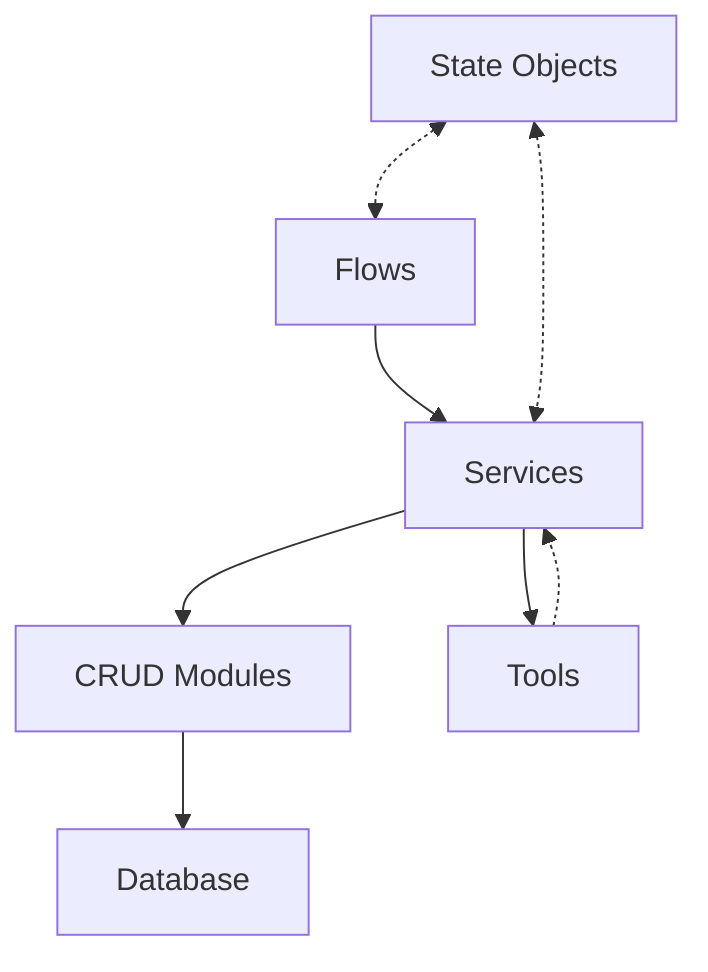

# System Patterns

## Architectural Patterns

### Hybrid Architecture

We use a hybrid architecture that combines elements of several architectural patterns:

1. **Repository Pattern** (via CRUD modules)
   - Encapsulates database operations
   - Provides a consistent interface for data access
   - Hides implementation details of data storage

2. **Service Layer Pattern**
   - Coordinates between CRUD operations and tools
   - Implements business logic and transaction management
   - Provides a clean API for higher-level components

3. **Pipeline Processing**
   - Used for article processing workflows
   - Sequential processing of data through multiple stages
   - Allows for flexibility in adding or modifying processing steps

4. **State-Based Pattern**
   - Introduced for tracking system state and handling complex workflows
   - Uses specialized state objects to encapsulate operation parameters and results
   - Provides better separation of concerns between components

### Component Relationships



- **Flows** orchestrate end-to-end processes using services
- **Services** coordinate between CRUD modules and tools
- **CRUD Modules** handle database operations
- **Tools** perform specific processing or analysis tasks
- **State Objects** carry operation parameters and results between components
- Tools return results to services, which may save them via CRUD modules

## Design Patterns

### Repository Pattern (CRUD)

All database operations are encapsulated in CRUD classes that follow a consistent pattern:

```python
class CRUDBase[T]:
    def get(self, db, id): ...
    def get_multi(self, db, skip, limit): ...
    def create(self, db, obj_in): ...
    def update(self, db, db_obj, obj_in): ...
    def delete(self, db, id): ...
```

Specialized CRUD classes extend this base class to add entity-specific operations:

```python
class CRUDEntity(CRUDBase[Entity]):
    def get_by_article(self, db, article_id): ...
    def get_by_text_and_article(self, db, text, article_id): ...
    def get_by_date_range_and_types(self, db, start_date, end_date, entity_types): ...
```

### Service Layer

Services coordinate higher-level operations between CRUD modules and tools:

```python
class AnalysisService:
    def __init__(self, analysis_result_crud=None, article_crud=None, entity_crud=None, session_factory=None):
        self.analysis_result_crud = analysis_result_crud or analysis_result
        self.article_crud = article_crud or article
        self.entity_crud = entity_crud or entity
        self.session_factory = session_factory or SessionManager
        
    def analyze_headline_trends(self, start_date, end_date, time_interval="day"):
        with self.session_factory() as session:
            # Use CRUD to get data
            # Use tools to analyze
            # Save results using CRUD
```

### State-Based Pattern

We use state objects to encapsulate the input parameters and results of complex operations:

```python
class EntityTrackingState(BaseModel):
    run_id: UUID = Field(default_factory=uuid4)
    article_id: int
    content: str
    title: str
    published_at: datetime
    entities: List[Dict[str, Any]] = Field(default_factory=list)
    status: TrackingStatus = Field(default=TrackingStatus.INITIALIZED)
    error_details: Optional[ErrorDetails] = None
    created_at: datetime = Field(default_factory=lambda: datetime.now(timezone.utc))
    last_updated: datetime = Field(default_factory=lambda: datetime.now(timezone.utc))
    run_logs: List[str] = Field(default_factory=list)
    
    def add_log(self, message: str): ...
    def set_error(self, task: str, error: Exception): ...
```

Services and flows then operate on these state objects:

```python
class EntityService:
    def process_article_with_state(self, state: EntityTrackingState) -> EntityTrackingState:
        try:
            # Process the article
            # Update state with results
            state.status = TrackingStatus.SUCCESS
        except Exception as e:
            state.set_error("processing", e)
        return state
```

### Dependency Injection Container

We use a dedicated dependency injection container to manage component relationships and resolve circular dependencies:

```python
class DIContainer:
    """Dependency Injection Container.
    
    This container manages service and component dependencies centrally,
    allowing for proper dependency resolution and avoiding circular imports.
    """
    
    def __init__(self):
        self._services = {}
        self._factories = {}
    
    def register(self, name, service):
        """Register a service with the container."""
        self._services[name] = service
        return service
    
    def register_factory(self, name, factory):
        """Register a factory function for lazy service creation."""
        self._factories[name] = factory
        return factory
    
    def get(self, name):
        """Get a service from the container.
        
        If the service doesn't exist but a factory is registered,
        the factory will be called to create the service.
        """
        # Return existing service if available
        if name in self._services:
            return self._services[name]
        
        # Otherwise try to create it from a factory
        if name in self._factories:
            service = self._factories[name]()
            self._services[name] = service
            return service
        
        return None
```

A centralized container initialization module registers all services:

```python
# Initialize container
container = DIContainer()

# Register database session factory
container.register("session_factory", SessionManager)

# Register CRUD modules
container.register("article_crud", article_crud)
container.register("entity_crud", entity_crud)
# ... more CRUD registrations ...

# Register services
container.register_factory("article_service", lambda: ArticleService(
    article_crud=container.get("article_crud"),
    analysis_result_crud=container.get("analysis_result_crud"),
    entity_service=container.get("entity_service"),
    session_factory=container.get("session_factory")
))
# ... more service registrations ...
```

Components still accept dependencies as constructor parameters, but they now use the container as a fallback:

```python
def _get_session(self) -> Session:
    """Get a database session."""
    if self.session_factory:
        return self.session_factory()
        
    # Get session factory from container as fallback
    session_factory = container.get("session_factory")
    if session_factory:
        return session_factory()
        
    # Last resort fallback
    from local_newsifier.database.engine import get_session
    return next(get_session())
```

This pattern provides:
- Centralized dependency management
- Resolution of circular dependencies
- Lazy loading of services
- Improved testability
- Clear component relationships

### Pipeline Processing

Article processing follows a pipeline pattern:

```python
class NewsPipeline:
    def process_article(self, article):
        article = self.fetch_content(article)
        article = self.extract_entities(article)
        article = self.analyze_sentiment(article)
        article = self.detect_topics(article)
        return article
```

### Context Managers for Sessions

Database sessions are managed using context managers:

```python
class SessionManager:
    def __enter__(self):
        engine = get_engine()
        self.session = Session(engine)
        return self.session

    def __exit__(self, exc_type, exc_val, exc_tb):
        if self.session:
            if exc_type:
                self.session.rollback()
            else:
                self.session.commit()
            self.session.close()
```

Services use this pattern for transaction management:

```python
with self.session_factory() as session:
    # Database operations
    # If an exception occurs, session will be rolled back
    # Otherwise, session will be committed
```

## Core Implementation Patterns

### Model Definitions

SQLModel is used for model definitions, providing both ORM and Pydantic validation:

```python
class Entity(SQLModel, table=True):
    id: Optional[int] = Field(default=None, primary_key=True)
    article_id: int = Field(foreign_key="article.id")
    text: str
    entity_type: str
    sentence_context: Optional[str] = None
    frequency: Optional[int] = None
    confidence: Optional[float] = Field(default=1.0)
    created_at: datetime = Field(default_factory=lambda: datetime.now(timezone.utc))
    updated_at: datetime = Field(default_factory=lambda: datetime.now(timezone.utc))
```

### Tool Implementation

Tools focus on specific processing or analysis tasks without direct database access:

```python
class TrendAnalyzer:
    def __init__(self, session=None):
        self.session = session
        self._cache = {}
        self.nlp = None
        
    def extract_keywords(self, headlines, top_n=20):
        # Process headlines to extract keywords
        # Return processed data
        
    def detect_keyword_trends(self, trend_data):
        # Analyze trend data to identify patterns
        # Return trend analysis results
```

### Error Handling

Structured error handling with appropriate error propagation:

```python
try:
    # Operation that might fail
except SomeSpecificException as e:
    # Handle specific exception
    return {"error": str(e)}
except Exception as e:
    # Log unexpected errors
    logger.exception(f"Unexpected error: {e}")
    raise
```

## Web API Patterns

### FastAPI Application Structure

The web API follows a structured approach to organization:

```
src/local_newsifier/api/
├── __init__.py          # Package initialization
├── dependencies.py      # Dependency injection
├── main.py              # App initialization and configuration
├── routers/             # Route definitions by feature
│   ├── __init__.py
│   └── system.py        # System-related endpoints
└── templates/           # Jinja2 templates for HTML responses
    ├── base.html        # Base template with common elements
    ├── index.html       # Landing page
    ├── tables.html      # Database tables list
    ├── table_details.html # Table details view
    └── 404.html         # Error page
```

### Dependency Injection

FastAPI's dependency injection system is used for database sessions:

```python
def get_session() -> Generator[Session, None, None]:
    """Get a database session.
    This dependency provides a database session to route handlers.
    The session is automatically closed when the request is complete.
    """
    with get_db_session() as session:
        yield session
```

Route handlers use this dependency:

```python
@router.get("/tables")
async def get_tables(request: Request, session: Session = Depends(get_session)):
    # Use session for database operations
    # ...
```

### Hybrid Response Model

The API supports both UI (HTML) and API (JSON) responses:

1. **HTML Responses** - For human interaction:
   ```python
   @router.get("/tables", response_class=HTMLResponse)
   async def get_tables(request: Request, session: Session = Depends(get_session)):
       tables_info = get_tables_info(session)
       return templates.TemplateResponse(
           "tables.html",
           {"request": request, "tables_info": tables_info}
       )
   ```

2. **JSON Responses** - For programmatic access:
   ```python
   @router.get("/tables/api", response_model=List[Dict])
   async def get_tables_api(session: Session = Depends(get_session)):
       return get_tables_info(session)
   ```

This approach provides both a user-friendly web interface and a machine-readable API.

## Testing Patterns

### Unit Testing with Mocks

Services and tools are tested using mock objects for dependencies:

```python
@patch("local_newsifier.tools.analysis.trend_analyzer.TrendAnalyzer")
def test_analyze_headline_trends(self, MockTrendAnalyzer, service, mock_session, mock_article_crud):
    # Setup mocks
    mock_article_crud.get_by_date_range.return_value = sample_articles
    mock_trend_analyzer = MockTrendAnalyzer.return_value
    mock_trend_analyzer.extract_keywords.return_value = [("term", 2)]
    
    # Call the method
    result = service.analyze_headline_trends(start_date, end_date)
    
    # Verify the result and mock interactions
    assert "trending_terms" in result
    mock_article_crud.get_by_date_range.assert_called_once_with(...)
```

### State-Based Testing

For state-based components, we test by verifying the state transformation:

```python
def test_process_method():
    # Setup mocks
    mock_entity_service = Mock(spec=EntityService)
    mock_state = Mock(spec=EntityTrackingState)
    mock_result_state = Mock(spec=EntityTrackingState)
    mock_entity_service.process_article_with_state.return_value = mock_result_state
    
    # Initialize flow
    flow = EntityTrackingFlow(entity_service=mock_entity_service)
    
    # Call process method
    result = flow.process(mock_state)
    
    # Verify method was called with correct state
    mock_entity_service.process_article_with_state.assert_called_once_with(mock_state)
    assert result is mock_result_state
```

### Context Manager Mocking

Properly mocking context managers for session handling:

```python
# Setup session context manager mock properly
mock_context_manager = MagicMock()
mock_context_manager.__enter__.return_value = mock_session
mock_context_manager.__exit__.return_value = None
mock_entity_service.session_factory.return_value = mock_context_manager
```

### Fixtures for Common Objects

Test fixtures for database sessions, mock objects, and sample data:

```python
@pytest.fixture
def mock_session():
    session = MagicMock()
    session.__enter__ = MagicMock(return_value=session)
    session.__exit__ = MagicMock(return_value=None)
    return session

@pytest.fixture
def sample_articles():
    return [
        Article(
            id=1,
            title="Test Article",
            content="Test content",
            published_at=datetime.now(timezone.utc)
        )
    ]
```

## Database Migration Patterns

### Alembic for Schema Versioning

We use Alembic to manage database migrations and schema evolution:

```
alembic/
├── versions/          # Migration script files
├── env.py             # Configuration for Alembic
└── alembic.ini        # Main configuration file
```

The migration workflow follows these patterns:

1. **Schema Changes**: When modifying model definitions, generate a migration
2. **Version Control**: Each migration is a versioned script tracking schema changes
3. **Dependency Chain**: Migrations form a directed graph with dependencies
4. **Reversibility**: All migrations support both upgrade and downgrade paths

### Migration Commands

Standard Alembic commands are used to manage migrations:

```bash
# Create a migration from the current model state
alembic revision --autogenerate -m "Description of change"

# Apply all pending migrations
alembic upgrade head

# Revert to a previous version
alembic downgrade <revision>

# Show migration history
alembic history
```

### Integration with SQLModel

Alembic is configured to work with SQLModel metadata:

```python
# In alembic/env.py
from sqlmodel import SQLModel
from local_newsifier.models import *

# Use SQLModel metadata for migration autogeneration
target_metadata = SQLModel.metadata
```

### Best Practices

1. Review autogenerated migrations before applying them
2. Focus migrations on specific, targeted changes
3. Test migrations in development before applying to production
4. Never modify existing committed migration scripts
5. Use descriptive migration messages
